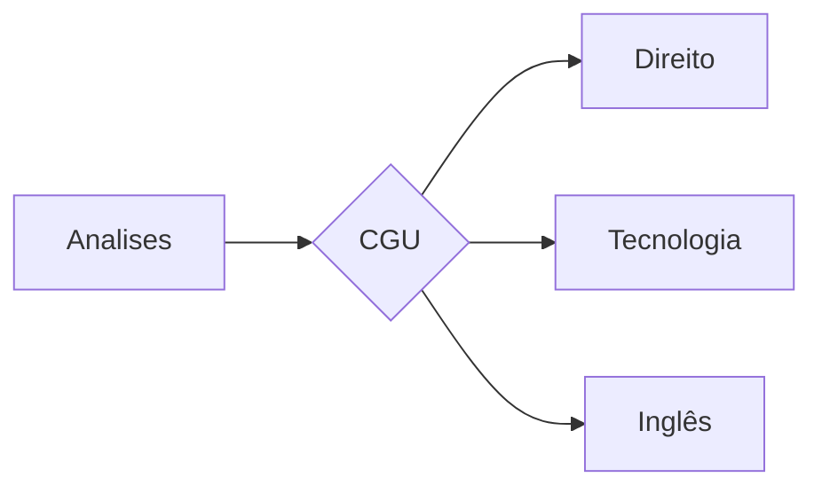

# Controladoria Geral da União - CGU

### 1.0 - EDITAL:

<ul>
  
  <li>
    <p><b><code> BANCA </code></b></p>
    <p><i> FGV:  </i></p>
  </li>
  
  <li>
    <p><b><code> CONTEUDO </code></b></p>
    <p><i> DIREITO </i></p>
    <p><i> TECNOLOGIA DA INFORMAÇÃO </i></p>
    <p><i> INGLêS </i></p>
  </li> 
  
  <li>
    <p><b><code> CRONOGRAMA </code></b></p>
    <p><i>  </i></p>
  </li>
  
</ul>

### 2.0 - PLANO DE ESTUDO

<ul>
  
  <li>
    <p><b><code> INICIO </code></b></p>
    <p><i> 33%  </i></p>
  </li>
  
  <li>
    <p><b><code> MEIO </code></b></p>
    <p><i> 63%  </i></p>
  </li> 
  
  <li>
    <p><b><code> FIM </code></b></p>
    <p><i> 99%  </i></p>
  </li>
  
</ul>

### FLUXOGRAMA/DIAGRAMA



### 3.0 - REVISÃO
```
<ul>
  
  <li>
    <p><b><code>1.1 - [VIRTUAL ENV] </code></b></p>
    <p><i> Instrução:  </i></p>
  </li>
  
  <li>
    <p><b><code>1.2 - [FRONT-END] </code></b></p>
    <p><i> Fase-1: https://www.youtube.com/watch?v=wCOInE7-E0I  </i></p>
  </li> 
  
  <li>
    <p><b><code>1.3 - [BACK-END] </code></b></p>
    <p><i>  </i></p>
  </li>
  
</ul>
```

